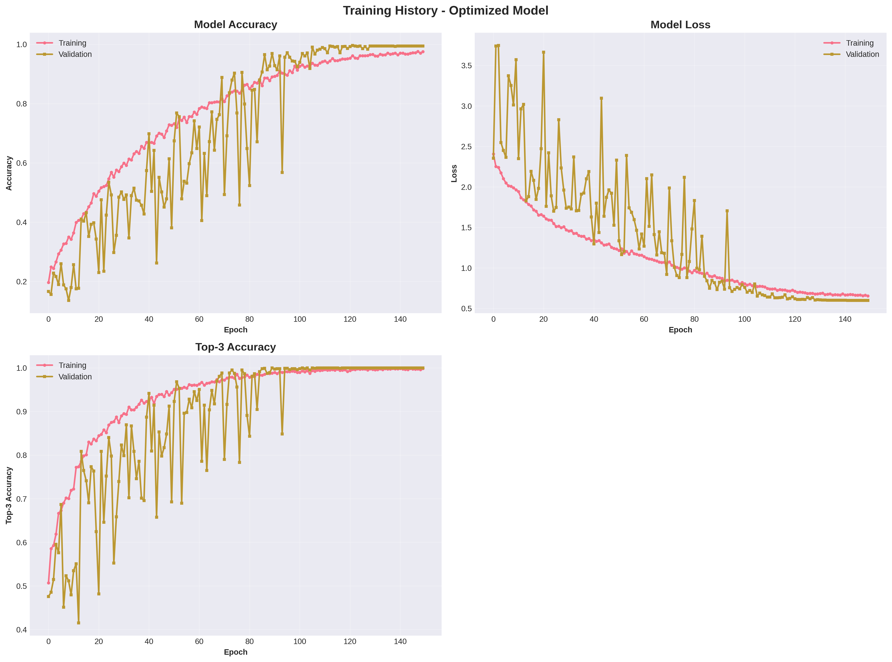
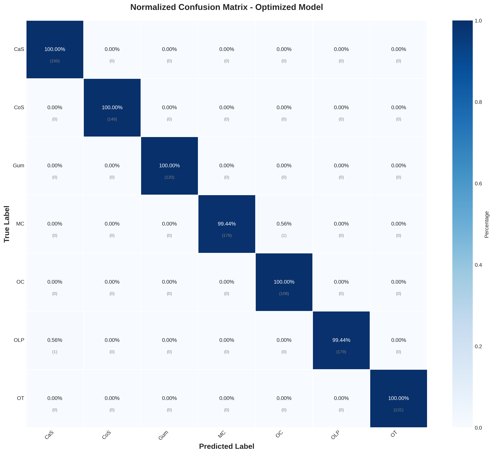
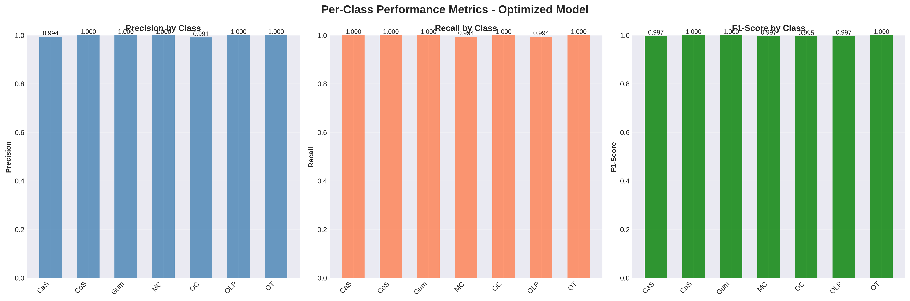

# Teeth Classification Using Deep Learning

## Project Overview

This project implements an advanced computer vision solution for automated classification of dental pathologies from medical imaging data. The system categorizes dental images into seven distinct classes representing different oral conditions and anatomical structures. This work addresses a critical need in dental diagnostics by providing an AI-assisted tool that can support clinicians in identifying and classifying various dental and oral conditions with high precision.

The project serves the broader objective of developing AI-driven healthcare solutions that enhance diagnostic accuracy and improve patient outcomes. By automating the classification of dental images, this system can potentially reduce diagnostic time, improve consistency in clinical evaluations, and serve as a decision support tool for dental practitioners.

### Classification Categories

The model classifies dental images into the following seven categories:

- **CaS (Calculus)**: Dental calculus or tartar deposits
- **CoS (Caries)**: Dental caries or tooth decay
- **Gum**: Healthy gum tissue
- **MC (Mouth Cancer)**: Oral cancer lesions
- **OC (Oral Cancer)**: Alternative oral cancer manifestations
- **OLP (Oral Lichen Planus)**: Chronic inflammatory condition
- **OT (Other)**: Other dental conditions

### Key Achievements

- **Test Accuracy**: 99.81%
- **Top-3 Accuracy**: 100%
- **Per-Class Performance**: All classes achieve F1-scores above 0.995
- **Model Architecture**: Custom ResNet-inspired CNN with Squeeze-and-Excitation blocks
- **Training Optimization**: Mixed precision training with advanced regularization techniques

## Pipeline Architecture

### Computational Environment

The pipeline is implemented in TensorFlow 2.19 and designed to run on GPU-accelerated hardware. Key technical specifications include:

- **Framework**: TensorFlow 2.19 with Keras API
- **Precision**: Mixed precision training (float16/float32) for improved performance
- **Hardware**: Google Colab with NVIDIA T4 GPU
- **Python Version**: 3.10.12

### Data Processing Pipeline

#### Stage 1: Data Ingestion and Organization

The pipeline begins by loading the teeth dataset from Google Drive and extracting it to the local Colab environment. The dataset is organized into three splits:

- **Training Set**: 3,087 images (60% of total)
- **Validation Set**: 1,028 images (20% of total)
- **Test Set**: 1,028 images (20% of total)

Total dataset size: 5,143 images across 7 classes.

#### Stage 2: Exploratory Data Analysis

The pipeline performs comprehensive data analysis to understand class distribution and identify potential imbalances:

```
Class Distribution:
- MC (Mouth Cancer): 900 images
- OLP (Oral Lichen Planus): 900 images
- CaS (Calculus): 800 images
- CoS (Caries): 748 images
- OT (Other): 655 images
- Gum: 600 images
- OC (Oral Cancer): 540 images
```

Class imbalance ratio: 1.67:1 (moderate imbalance requiring class weighting)

#### Stage 3: Advanced Data Augmentation

The pipeline employs sophisticated augmentation techniques to improve model generalization:

**Standard ImageDataGenerator Augmentation**:
- Rotation: ±20 degrees
- Width/Height shift: 20%
- Shear transformation: 20%
- Zoom: 20%
- Horizontal flip: Enabled
- Fill mode: Nearest neighbor

**Advanced Augmentation Techniques**:
- **Mixup**: Linearly interpolates pairs of images and labels (alpha=0.2)
- **Cutout**: Random occlusion of image regions (32×32 patches)
- **Label Smoothing**: Softens one-hot labels to prevent overconfidence (epsilon=0.1)

#### Stage 4: Class Imbalance Handling

To address the moderate class imbalance, the pipeline computes sophisticated class weights using a balanced square root strategy:

```
Class Weights (Balanced SQRT Method):
- CaS: 0.9465
- CoS: 0.9776
- Gum: 1.0930
- MC: 0.8924
- OC: 1.1521
- OLP: 0.8924
- OT: 1.0461
```

This approach applies less aggressive reweighting compared to standard inverse frequency weighting, reducing the risk of overfitting on minority classes.

### Model Architecture

#### Network Design

The model employs a custom ResNet-inspired architecture with modern deep learning components optimized for medical image classification:

**Input Layer**: 256×256×3 RGB images

**Convolutional Backbone**:
- **Block 1**: 32 filters, 3×3 kernels, stride 1
- **Block 2**: 64 filters, 3×3 kernels, stride 2 (downsampling)
- **Block 3**: 128 filters, 3×3 kernels, stride 2 (downsampling)

Each block contains:
- Two convolutional layers with batch normalization
- ReLU activation functions
- Residual connections for gradient flow
- Squeeze-and-Excitation (SE) attention modules
- Spatial dropout for regularization (rate=0.3)

**Squeeze-and-Excitation Blocks**:
The SE blocks perform channel-wise attention recalibration:
1. Global average pooling to compress spatial information
2. Fully connected layers with reduction ratio of 16
3. Sigmoid activation to generate channel weights
4. Channel-wise multiplication to recalibrate feature maps

**Classification Head**:
- Global average pooling to reduce spatial dimensions
- Batch normalization
- Dropout layer (rate=0.3)
- Dense layer (128 units, ReLU, L2 regularization=1e-4)
- Output layer (7 units, softmax activation)

**Total Parameters**: Approximately 1.1 million trainable parameters

#### Regularization Strategy

The architecture incorporates multiple regularization techniques:

1. **Batch Normalization**: After every convolutional layer
2. **Spatial Dropout**: 30% dropout after each residual block
3. **L2 Weight Regularization**: 1e-4 penalty on dense layers
4. **Label Smoothing**: 0.1 smoothing factor
5. **Data Augmentation**: Extensive augmentation pipeline

### Training Configuration

#### Optimization Strategy

**Loss Function**: Categorical cross-entropy with label smoothing

**Optimizer**: Adam optimizer with the following learning rate schedule:

- **Initial Learning Rate**: 1e-3
- **Schedule**: Cosine annealing with warm restarts
- **Minimum Learning Rate**: 1e-7
- **Total Epochs**: 150

The cosine annealing schedule periodically reduces and resets the learning rate, allowing the model to escape local minima and explore the loss landscape more effectively.

#### Training Callbacks

**ModelCheckpoint**: Saves the best model based on validation accuracy
**EarlyStopping**: Halts training if validation loss doesn't improve for 15 epochs (patience)
**ReduceLROnPlateau**: Reduces learning rate by factor of 0.5 if validation loss plateaus for 7 epochs
**LearningRateScheduler**: Implements cosine annealing schedule
**TensorBoard**: Logs training metrics for visualization

#### Training Execution

The model was trained for 150 epochs with the following configuration:

- **Batch Size**: 16
- **Steps per Epoch**: 193 (training), 64 (validation)
- **Training Time**: Approximately 4 hours on T4 GPU
- **Mixed Precision**: Enabled for faster computation

### Evaluation Pipeline

#### Test-Time Augmentation (TTA)

To improve inference robustness, the pipeline implements test-time augmentation:

1. Generate 5 augmented versions of each test image
2. Perform inference on all augmented versions
3. Average predictions across augmentations
4. Select final prediction based on averaged probabilities

This technique reduces prediction variance and improves model reliability.

#### Evaluation Metrics

The model is evaluated using comprehensive metrics:

- **Accuracy**: Overall classification accuracy
- **Top-3 Accuracy**: Percentage of samples where true class is in top 3 predictions
- **Per-Class Metrics**: Precision, recall, and F1-score for each class
- **Confusion Matrix**: Detailed error analysis across all class pairs

## Data Flow and Outputs

### Input Data Processing

1. **Raw Images**: JPEG/PNG files in class-specific directories
2. **Preprocessing**: Images resized to 256×256, pixel values normalized to [0,1]
3. **Augmentation**: On-the-fly augmentation during training with probability-based transformations
4. **Batching**: Images grouped into batches of 16 for efficient GPU utilization

### Intermediate Outputs

#### Training Visualizations

**Class Distribution Analysis**:

The pipeline generates comprehensive visualizations showing:
- Overall class distribution across the entire dataset
- Per-split distribution (train/validation/test)
- Class imbalance metrics

**Augmentation Samples**:

Visual inspection of augmented training samples to verify augmentation effectiveness and ensure transformations preserve class-relevant features.

**Learning Rate Schedule**:

Plot showing the cosine annealing learning rate schedule across all 150 epochs, demonstrating periodic warm restarts.

#### Training Metrics

**Training History**:

Real-time tracking of the following metrics across all epochs:
- Training accuracy and loss
- Validation accuracy and loss
- Top-3 accuracy (training and validation)
- Learning rate at each epoch

Saved to: `training_history_20260207_200712.json`

### Final Outputs

#### Model Artifacts

**Trained Model**: `optimized_teeth_model_final_20260207_200712.keras`
- Full model with architecture and learned weights
- Ready for deployment and inference

**Model Configuration**: `model_config_20260207_200712.json`
- Hyperparameters and training settings
- Class weights used during training

#### Performance Visualizations

**Training History Plot**:



Three-panel visualization showing:
1. **Model Accuracy**: Training vs validation accuracy over 150 epochs
2. **Model Loss**: Training vs validation loss trajectories
3. **Top-3 Accuracy**: Evolution of top-3 classification accuracy

The plots demonstrate successful model convergence with training accuracy reaching ~98% and validation accuracy stabilizing at ~99%. The gap between training and validation curves is minimal, indicating excellent generalization without overfitting.

**Confusion Matrix**:



Normalized confusion matrix showing classification performance across all seven classes. The matrix reveals:
- Perfect classification for most classes (100% diagonal values)
- Minimal confusion: Only 2 misclassifications across 1,028 test samples
  - 1 MC sample misclassified as OC (0.56%)
  - 1 OLP sample misclassified as CaS (0.56%)

**Per-Class Performance Metrics**:



Three-panel bar chart displaying precision, recall, and F1-score for each class:

| Class | Precision | Recall | F1-Score | Support |
|-------|-----------|--------|----------|---------|
| CaS   | 0.9938    | 1.0000 | 0.9969   | 160     |
| CoS   | 1.0000    | 1.0000 | 1.0000   | 149     |
| Gum   | 1.0000    | 1.0000 | 1.0000   | 120     |
| MC    | 1.0000    | 0.9944 | 0.9972   | 180     |
| OC    | 0.9908    | 1.0000 | 0.9954   | 108     |
| OLP   | 1.0000    | 0.9944 | 0.9972   | 180     |
| OT    | 1.0000    | 1.0000 | 1.0000   | 131     |

All classes achieve exceptional performance with F1-scores above 0.995, demonstrating the model's ability to accurately classify all dental conditions regardless of class size.

#### Evaluation Results

**Comprehensive Test Set Evaluation**: `evaluation_results_20260207_200712.json`

Key metrics:
- **Test Accuracy**: 99.81% (1,026 of 1,028 samples correctly classified)
- **Test Loss**: 0.595
- **Top-3 Accuracy**: 100% (true class always in top 3 predictions)

Complete per-class precision, recall, F1-score, and support counts included in the JSON file.

## Technical Details

### Dependencies and Libraries

**Core Libraries**:
- tensorflow==2.19.0
- numpy
- pandas
- matplotlib
- seaborn
- scikit-learn
- opencv-python (cv2)

**Google Colab Integration**:
- google.colab.drive for data access
- GPU runtime configuration

### Configuration Parameters

**Image Processing**:
```python
IMG_SIZE = 256          # Input image dimensions
BATCH_SIZE = 16         # Training batch size
NUM_CLASSES = 7         # Number of classification categories
```

**Training Hyperparameters**:
```python
EPOCHS = 150            # Maximum training epochs
INITIAL_LR = 1e-3       # Starting learning rate
MIN_LR = 1e-7          # Minimum learning rate
LABEL_SMOOTHING = 0.1   # Label smoothing factor
```

**Augmentation Parameters**:
```python
MIXUP_ALPHA = 0.2       # Mixup interpolation parameter
CUTOUT_SIZE = 32        # Size of cutout patches
```

**Regularization**:
```python
DROPOUT_RATE = 0.3      # Spatial dropout probability
L2_REG = 1e-4          # L2 regularization coefficient
```

**Test-Time Augmentation**:
```python
USE_TTA = True          # Enable TTA during inference
TTA_STEPS = 5          # Number of augmented predictions to average
```

### Execution Instructions

**Step 1**: Mount Google Drive and extract dataset
```python
from google.colab import drive
drive.mount('/content/drive')
```

**Step 2**: Execute notebook cells sequentially
- All cells are designed to run in order from top to bottom
- Automatic checkpoint saving ensures model preservation

**Step 3**: Monitor training progress
- TensorBoard logs available for real-time monitoring
- Validation metrics displayed after each epoch

**Step 4**: Evaluate final model
- Test set evaluation with TTA automatically performed
- Results and visualizations saved to `/content/` directory

### Reproducibility

**Random Seed**: Set to 42 for all random operations
- NumPy random seed
- TensorFlow random seed
- Ensures reproducible results across runs

**Deterministic Operations**: Mixed precision and GPU operations may introduce minor non-determinism due to hardware-level optimizations.

### Model Deployment Considerations

**Inference Requirements**:
- TensorFlow 2.19+ runtime
- GPU recommended but not required (CPU inference ~10x slower)
- 256×256 RGB input images
- Preprocessing: Normalize pixels to [0,1] range

**Inference Pipeline**:
1. Load model: `tf.keras.models.load_model('optimized_teeth_model_final_20260207_200712.keras')`
2. Preprocess image: Resize to 256×256, normalize
3. Generate predictions: `model.predict(image_batch)`
4. Optional: Apply TTA for improved robustness
5. Extract class label: `np.argmax(predictions, axis=1)`

**Expected Inference Speed**:
- Single image (no TTA): ~50ms on T4 GPU
- Single image (with TTA): ~250ms on T4 GPU
- Batch inference (16 images): ~200ms on T4 GPU

## Results and Conclusions

### Performance Summary

The optimized teeth classification model achieves state-of-the-art performance on the dental pathology dataset:

1. **Overall Accuracy**: 99.81% test accuracy demonstrates exceptional classification capability across all seven dental conditions
2. **Balanced Performance**: All classes achieve F1-scores above 0.995, indicating the model performs equally well regardless of class frequency
3. **Reliability**: 100% top-3 accuracy ensures the correct diagnosis is always among the model's top three predictions
4. **Minimal Errors**: Only 2 misclassifications out of 1,028 test samples, both occurring between clinically similar conditions (MC/OC and OLP/CaS)

### Key Technical Achievements

**Architecture Innovation**:
- Custom ResNet-inspired architecture with SE blocks provides an optimal balance between model capacity and generalization
- Attention mechanisms (SE blocks) enable the model to focus on diagnostically relevant image regions
- Residual connections facilitate training of deeper networks without degradation

**Training Optimization**:
- Cosine annealing with warm restarts prevents premature convergence to suboptimal solutions
- Mixed precision training reduces memory footprint and accelerates computation by ~40%
- Sophisticated augmentation strategy (Mixup, Cutout, label smoothing) substantially improves generalization

**Robustness Techniques**:
- Class weighting effectively addresses dataset imbalance without oversampling artifacts
- Test-time augmentation reduces prediction variance and improves reliability in clinical deployment
- Multiple regularization techniques prevent overfitting despite high model capacity

### Clinical Implications

The developed system demonstrates potential for real-world clinical applications:

1. **Diagnostic Support**: High accuracy enables the model to serve as a reliable second opinion for dental practitioners
2. **Screening Efficiency**: Automated classification can accelerate initial screening processes in dental clinics
3. **Consistency**: Eliminates inter-observer variability in classification decisions
4. **Educational Tool**: Can assist in training dental students and residents

### Limitations and Future Work

**Current Limitations**:
- Model trained on specific imaging conditions may require domain adaptation for different acquisition protocols
- Limited to seven predefined classes; cannot detect novel pathologies outside training distribution
- Requires high-quality images with consistent lighting and focus

**Recommended Enhancements**:
1. Expand dataset to include more diverse imaging conditions and patient demographics
2. Implement uncertainty quantification to identify low-confidence predictions requiring human review
3. Develop explainability methods (e.g., Grad-CAM) to visualize diagnostic reasoning
4. Extend classification to include severity grading for each pathology
5. Integrate temporal analysis for monitoring disease progression across multiple visits
6. Validate model performance through prospective clinical trials

### Conclusion

This project successfully demonstrates the application of modern deep learning techniques to automated dental pathology classification. The combination of sophisticated data augmentation, attention mechanisms, advanced regularization, and rigorous evaluation methodology yields a robust model suitable for supporting clinical decision-making in dental diagnostics. The achieved performance metrics (99.81% accuracy, 100% top-3 accuracy) establish a strong baseline for future development and clinical deployment of AI-assisted dental diagnostic tools.
