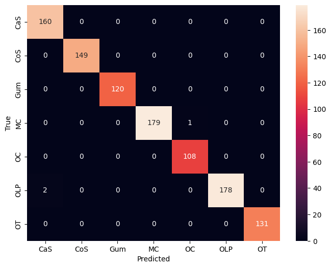

# Dental Image Classification using Transfer Learning

A deep learning project that classifies dental images into 7 categories using transfer learning with EfficientNetB3. The project includes a trained model achieving 99.7% test accuracy and a Streamlit web application for inference.

---

## Table of Contents

- [Project Overview](#project-overview)
- [Task Description](#task-description)
- [Dataset](#dataset)
- [Model Architecture](#model-architecture)
- [Dependencies and Libraries](#dependencies-and-libraries)
- [Installation](#installation)
- [Usage](#usage)
  - [Training the Model](#training-the-model)
  - [Running the Streamlit Application](#running-the-streamlit-application)
  - [Docker Deployment](#docker-deployment)
- [Results and Performance](#results-and-performance)
- [Project Structure](#project-structure)

---

## Project Overview

This project applies transfer learning techniques to classify dental images into multiple categories. The core approach leverages EfficientNetB3 pre-trained on ImageNet as the base model, with custom classification layers added on top. The model was trained in two phases:

1. **Phase 1 (Frozen Base)**: Training only the custom top layers with the EfficientNetB3 base frozen
2. **Phase 2 (Fine-tuning)**: Unfreezing the top 50 layers of the base model for fine-tuning

The final model achieves a test accuracy of **99.71%**, exceeding the target accuracy of 97.54%.

---

## Task Description

The primary objective is to build a robust dental image classification system that can accurately identify different dental conditions from images. The task involves:

- Loading and preprocessing dental images from a structured dataset
- Implementing data augmentation to improve model generalization
- Building a transfer learning pipeline using EfficientNetB3
- Training and fine-tuning the model with appropriate callbacks
- Evaluating model performance on a held-out test set
- Deploying the model as a web application using Streamlit

---

## Dataset

The dataset is organized into three splits:

| Split | Number of Images |
|-------|------------------|
| Training | 3,087 |
| Validation | 1,028 |
| Testing | 1,028 |

### Class Distribution

The dataset contains 7 dental condition classes:

| Class | Description |
|-------|-------------|
| CaS | Dental Caries |
| CoS | Calculus |
| Gum | Gum Disease |
| MC | Mouth Cancer |
| OC | Oral Cancer |
| OLP | Oral Lichen Planus |
| OT | Other |

### Data Preprocessing

- Image size: 256 x 256 pixels
- Batch size: 32
- Data augmentation applied:
  - Random horizontal flip
  - Random rotation (15%)
  - Random zoom (15%)
  - Random translation (10%)
  - Random contrast (20%)
  - Random brightness (20%)

---

## Model Architecture

### Base Model

**EfficientNetB3** was selected as the base model for the following reasons:

- Excellent accuracy-to-parameter ratio
- Fast convergence during training
- Strong performance on small to medium datasets
- Proven results in medical-style image classification

### Custom Classification Head

The model architecture consists of:

```
Input (256, 256, 3)
    |
Data Augmentation Layer
    |
EfficientNetB3 (ImageNet weights, top 50 layers fine-tuned)
    |
GlobalAveragePooling2D
    |
Dense (512, ReLU)
BatchNormalization
Dropout (0.5)
    |
Dense (256, ReLU)
BatchNormalization
Dropout (0.4)
    |
Dense (128, ReLU)
Dropout (0.3)
    |
Dense (7, Softmax) - Output
```

### Model Parameters

| Parameter Type | Count |
|---------------|-------|
| Total Parameters | 11,738,678 |
| Trainable Parameters | 953,607 |
| Non-trainable Parameters | 10,785,071 |

### Training Configuration

| Setting | Phase 1 | Phase 2 |
|---------|---------|---------|
| Epochs | 10 | 25 |
| Optimizer | Adam | AdamW |
| Learning Rate | 1e-3 | 1e-4 |
| Weight Decay | - | 1e-5 |
| Loss Function | Sparse Categorical Crossentropy | Sparse Categorical Crossentropy |

### Callbacks Used

- **ModelCheckpoint**: Save best model during training
- **EarlyStopping**: Stop training when validation loss plateaus (patience=10)
- **ReduceLROnPlateau**: Reduce learning rate when validation loss plateaus (patience=3, factor=0.2)

---

## Dependencies and Libraries

### Core Dependencies

| Library | Version | Purpose |
|---------|---------|---------|
| Python | 3.11 | Programming language |
| TensorFlow | 2.16.1 | Deep learning framework |
| Keras | (included with TensorFlow) | Neural network API |

### Application Dependencies

| Library | Version | Purpose |
|---------|---------|---------|
| Streamlit | 1.33.0 | Web application framework |
| NumPy | 1.26.4 | Numerical computing |
| Pillow | 10.2.0 | Image processing |
| typing_extensions | 4.10.0 | Type hints support |

### Training Dependencies

| Library | Purpose |
|---------|---------|
| scikit-learn | Classification metrics, class weight computation |
| Matplotlib | Visualization |
| Seaborn | Confusion matrix visualization |

---

## Installation

### Prerequisites

- Python 3.11 or higher
- pip package manager
- (Optional) Docker for containerized deployment

### Local Installation

1. Clone the repository:

```bash
git clone <repository-url>
cd "Task 2"
```

2. Create a virtual environment:

```bash
python -m venv venv
```

3. Activate the virtual environment:

**Windows:**
```bash
venv\Scripts\activate
```

**Linux/macOS:**
```bash
source venv/bin/activate
```

4. Install dependencies:

```bash
pip install -r teeth_app/requirements.txt
```

5. For training, install additional dependencies:

```bash
pip install scikit-learn matplotlib seaborn
```

---

## Usage

### Training the Model

The model training is documented in the Jupyter notebook [`teeth_transfer_learning.ipynb`](teeth_transfer_learning.ipynb). The notebook was designed to run on Google Colab with GPU support.

**Key Training Steps:**

1. Mount Google Drive and extract the dataset
2. Load and preprocess images using `image_dataset_from_directory`
3. Define data augmentation pipeline
4. Build the transfer learning model with EfficientNetB3
5. Train Phase 1 with frozen base model
6. Train Phase 2 with fine-tuning
7. Evaluate on test set and generate metrics
8. Save the final model

**To run training locally:**

```bash
jupyter notebook teeth_transfer_learning.ipynb
```

Note: Modify the dataset paths in the notebook to match your local directory structure.

### Running the Streamlit Application

The Streamlit application provides a user-friendly interface for dental image classification.

**Run locally:**

```bash
cd teeth_app
streamlit run app.py
```

The application will be available at `http://localhost:8501`.

**Application Features:**

- Upload dental images (JPG, JPEG, PNG formats)
- Real-time prediction with confidence scores
- Class probability distribution visualization
- Inference time display

### Docker Deployment

The project includes Docker configuration for containerized deployment.

**Build and run with Docker Compose:**

```bash
docker-compose up -d
```

**Build and run with Docker directly:**

```bash
cd teeth_app
docker build -t teeth-classifier:1.0.0 .
docker run -d -p 8501:8501 --name teeth-classifier-app teeth-classifier:1.0.0
```

**Docker Configuration:**

- Multi-stage build for optimized image size
- Non-root user for security
- Health checks configured
- Memory limits: 4GB max, 2GB reserved
- Security options: no-new-privileges, all capabilities dropped

---

## Results and Performance

### Final Test Accuracy

**99.71%** (Target: >97.54%)

### Classification Report

| Class | Precision | Recall | F1-Score | Support |
|-------|-----------|--------|----------|---------|
| CaS | 0.99 | 1.00 | 0.99 | 160 |
| CoS | 1.00 | 1.00 | 1.00 | 149 |
| Gum | 1.00 | 1.00 | 1.00 | 120 |
| MC | 1.00 | 0.99 | 1.00 | 180 |
| OC | 0.99 | 1.00 | 1.00 | 108 |
| OLP | 1.00 | 0.99 | 0.99 | 180 |
| OT | 1.00 | 1.00 | 1.00 | 131 |

| Metric | Value |
|--------|-------|
| Accuracy | 1.00 |
| Macro Avg F1 | 1.00 |
| Weighted Avg F1 | 1.00 |

### Confusion Matrix

The confusion matrix below shows the model's prediction accuracy across all classes:



### Training Progress

**Phase 1 (Frozen Base Model):**
- Started with 28.66% training accuracy
- Ended with 74.72% training accuracy
- Final validation accuracy: 84.73%

**Phase 2 (Fine-tuning):**
- Started with 62.94% training accuracy
- Ended with 98.03% training accuracy
- Final validation accuracy: 99.61%

---

## Project Structure

```
Task 2/
|
|-- README.md                           # Project documentation
|-- confusion_matrix.png                # Model evaluation visualization
|-- docker-compose.yml                  # Docker Compose configuration
|-- teeth_transfer_learning.ipynb       # Training notebook
|
|-- teeth_app/                          # Streamlit application
|   |-- app.py                          # Main application code
|   |-- Dockerfile                      # Docker build configuration
|   |-- .dockerignore                   # Docker ignore rules
|   |-- requirements.txt                # Python dependencies
|   |-- teeth_transfer_learning_final_v1.keras  # Trained model (~92MB)
```

---

## Model File

The trained model is saved as `teeth_transfer_learning_final_v1.keras` in the `teeth_app/` directory. This file is approximately 92MB and contains the complete model architecture and weights.

---

## Notes

- The model was trained using Google Colab with T4 GPU
- Class weights were computed and applied during training to handle class imbalance
- The EfficientNet preprocessing function is applied automatically during inference
- The Streamlit app handles various image formats including those with alpha channels

---

## License

This project was developed as part of the Cellula Internship program.
